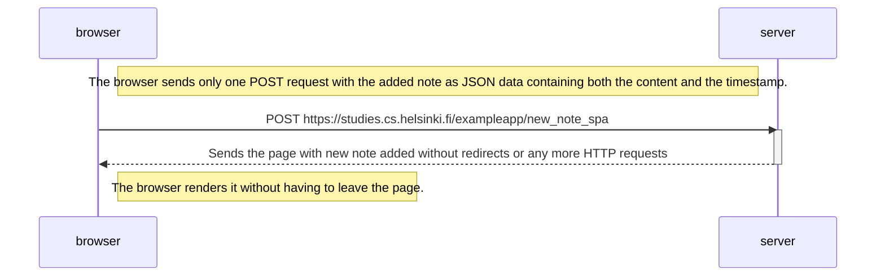

```mermaid   

    sequenceDiagram
    participant browser
    participant server

    Note right of browser: The browser sends only one POST request with the added note as JSON data containing both the content and the timestamp.

    browser->>server: POST https://studies.cs.helsinki.fi/exampleapp/new_note_spa
    activate server
    server-->>browser: Sends the page with new note added without redirects or any more HTTP requests
    deactivate server

    Note right of browser: The browser renders it without having to leave the page.
```
